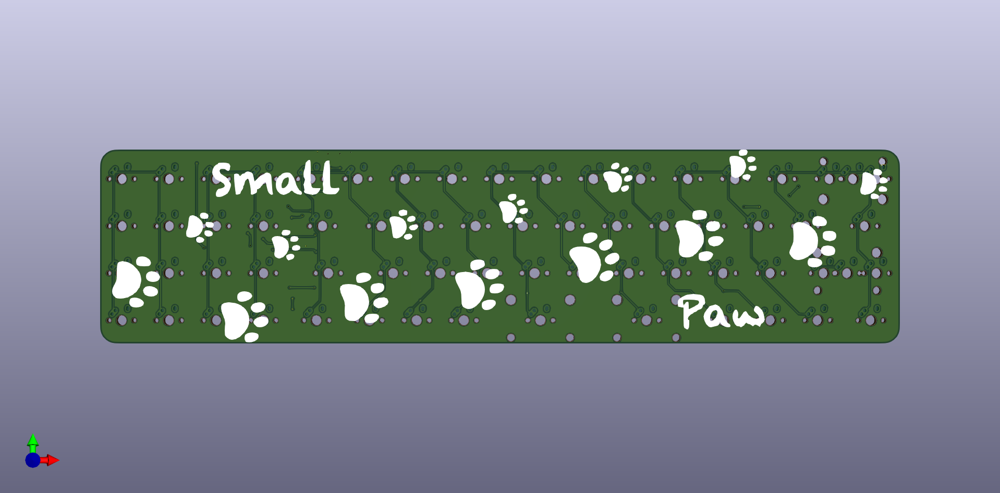

# Smallpaw

The Smallpaw is a 40% keyboard at heart, with the addition of a left-handed "Southpaw" numpad.

[Original concept and build by /u/BubaThePig](https://www.reddit.com/r/MechanicalKeyboards/comments/95qxa0/made_my_first_keeb/), PyroL reached out to them asking to make a PCB for practice.

Latest render of PCB:

To-do:
[ ] Mounting holes
[ ] Connect r/c to MCU
